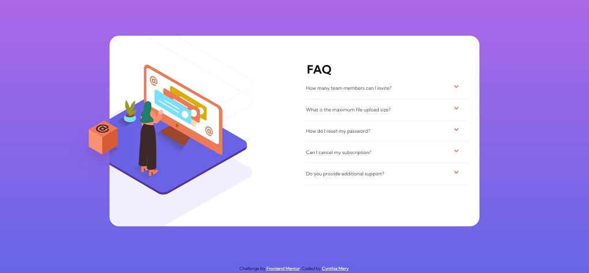

# Frontend Mentor - FAQ accordion card solution

This is a solution to the [FAQ accordion card challenge on Frontend Mentor](https://www.frontendmentor.io/challenges/faq-accordion-card-XlyjD0Oam). 

## Table of contents

- [Overview](#overview)
  - [The challenge](#the-challenge)
  - [Screenshot](#screenshot)
  - [Links](#links)
- [My process](#my-process)
  - [Built with](#built-with)
  - [Useful resources](#useful-resources)
- [Author](#author)
- [Acknowledgments](#acknowledgments)

## Overview

### The challenge

Users should be able to:

- View the optimal layout for the component depending on their device's screen size
- See hover states for all interactive elements on the page
- Hide/Show the answer to a question when the question is clicked

### Screenshot

### Links

- Solution URL: [https://github.com/cynmery/FAQ-Accordion-Card/blob/main/index.html
- Live Site URL: [https://cynmery.github.io/FAQ-Accordion-Card/]

### Built with

- Semantic HTML5 markup
- CSS custom properties
- Flexbox
- JavaScript

### Useful resources

- [https://css-tricks.com/snippets/css/a-guide-to-flexbox/] - Good website to reference back to when working with Flexbox

### Author
Cynthia Mery
GitHub: https://github.com/cynmery
